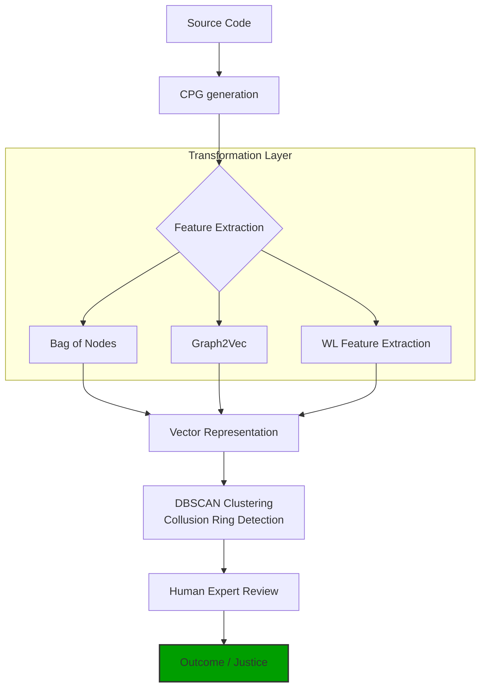

# Collusion Detection Software

## Overview
This project implements a multi-stage pipeline to detect code plagiarism using advanced Software Engineering and Machine Learning techniques. It automates the process of analyzing source code, extracting structural features, and identifying suspicious patterns that may indicate collusion.



## Setup & Installation

### Installation

#### Joern
Visit [Joern Installation](https://docs.joern.io/installation/) to install joern-cli on your system

#### Python 
Install python3 on your system, if in doubt visit https://www.python.org/

#### Ollama
This project optionally uses Ollama to generate code for testing.

Visit [Ollama Installation](https://ollama.com/download) to install ollama on your system

### Setup

#### Create Virtual Environment 
Create a Python virtual environment to manage dependencies

*NIX systems (Linux/Mac)
```bash
python3 -m venv .venv
source .venv/bin/activate
```

#### Install Dependencies
```bash
pip install pandas numpy matplotlib scikit-learn
```

### Usage

For ease of use there's also `run-all.sh` which runs the entire pipeline, it is to be run in a folder with all the source code files, currently runs with assumption of C files.

This project uses the pipeline as seen above in the diagram.

Everything is to be done in one folder, in my case it's the `out/` folder.

1. Gather code

You can use the included ollama script with granite4.1:8b to generate synthetic code.

You can also drop all your code inside the `out/` folder, everything is recursive.

2. Converting to CPGs

At the moment we assume C source code from students.

There's the `generate-c2cpg.sh` script in the `convert-to-cpg/` folder. It runs with the assumption that you have `c2cpg.sh` available in your $PATH.

3. Feature Extraction

There's a script called `bag-of-nodes.sh` in the `normalisation/` folder which converts CPGs into a json which shows the 'bag of nodes' for each file. It uses Joern as well.

4. Clustering

The `dbscan.py` script in the `clustering/dbscan/` folder runs clustering algorithms the nomralised data from above. There's adapters for each method in the `adpaters/` folder. At the moment it only has an adapter for Bag of Nodes.

It uses DBSCAN to find clusters of similar code.

5. Visualization

The `dbscan.py` script also generates a visualization of the clusters.