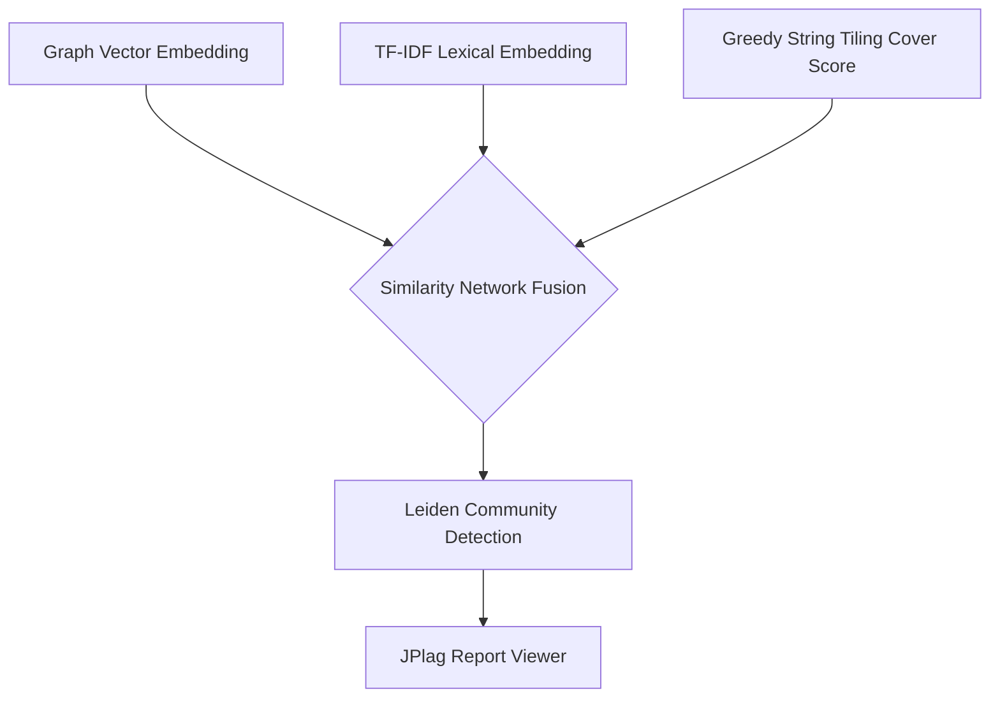

# Multi signal approach


```mermaid
graph TD
    %% Input Signals
    A[Graph Vector Embedding] --> D{Similarity Network Fusion}
    B[TF-IDF Lexical Embedding] --> D
    C[Greedy String Tiling Cover Score] --> D

    %% Processing Pipeline
    D --> E[Leiden Community Detection]

    %% Output
    E --> F[JPlag Report Viewer]
```

### Quick runner command

```bash
docker run \
    -v ~/Downloads/ReplicationPackage/code/:/app/submissions:ro,z \ # ,z is for SELinux purposes
    -v ~/.cache:/root/.cache:rw,z \
    -it cds:latest \
    /bin/bash # Drop into shell for testing
```
