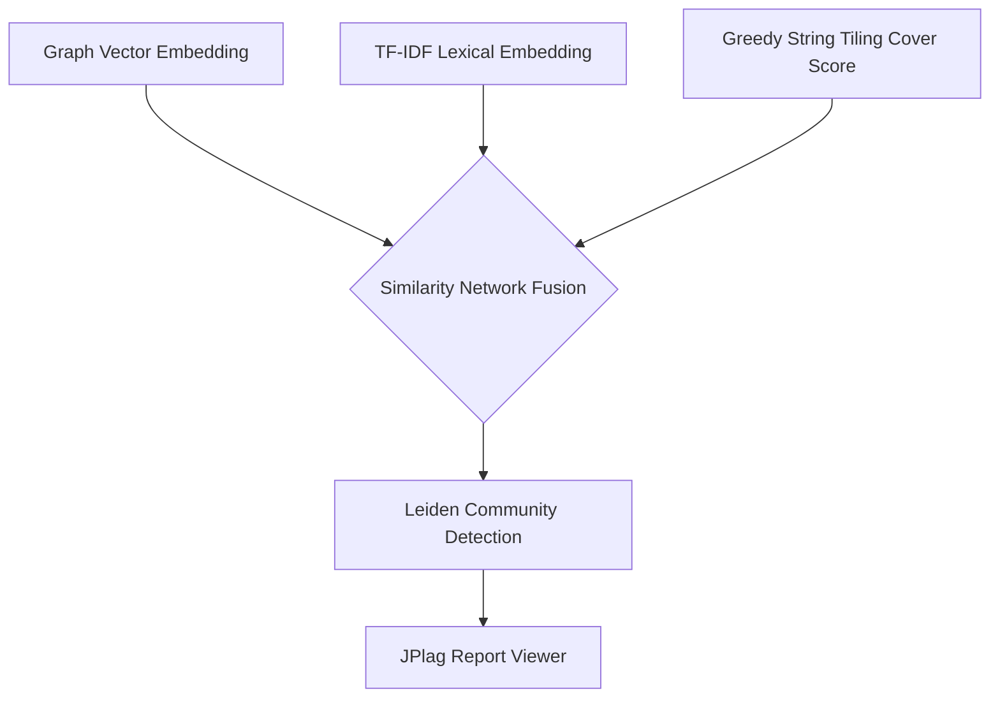

# Multi signal approach

```mermaid
graph TD
    %% Input Signals
    A[Graph Vector Embedding] --> D{Similarity Network Fusion}
    B[TF-IDF Lexical Embedding] --> D
    C[Greedy String Tiling Cover Score] --> D

    %% Processing Pipeline
    D --> E[Leiden Community Detection]

    %% Output
    E --> F[JPlag Report Viewer]
```
