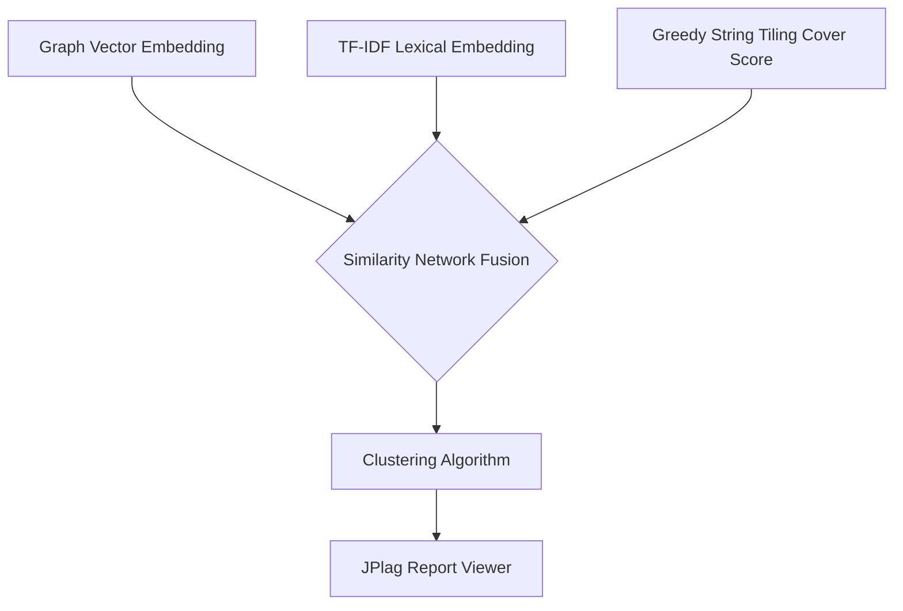

# Collusion Detection Software

A multi-signal approach to programming collusion detection. The system combines graph-based, lexical, and token-level similarity signals using Similarity Network Fusion (SNF), followed by clustering.


```mermaid
graph TD
    A[Graph Vector Embedding] --> D{Similarity Network Fusion}
    B[TF-IDF Lexical Embedding] --> D
    C[Greedy String Tiling Cover Score] --> D
    D --> E[Clustering Algorithm]
    E --> F[JPlag Report Viewer]
```

## Requirements

The software is run using Docker. Install [Docker](https://docs.docker.com/get-docker/) before proceeding.

The published image is:

```text
ghcr.io/akanksh-ch/collusion-detection-software:latest
```

---

## PROGpedia19

Place the PROGpedia19 submissions in a local directory and run:

```bash
docker run \
    -v /path/to/Progpedia:/app/submissions:rw,z \
    -v /path/to/output:/app/output:rw,z \
    -v /path/to/cache:/root/.cache:rw,z \
    -it ghcr.io/akanksh-ch/collusion-detection-software:latest \
    python main.py /app/submissions \
        --dataset progpedia19 \
        --fusion-method snf \
        --auto-tune \
        --output /app/output/progpedia19-metrics.json
```

Replace:

* `/path/to/Progpedia` with the location of the PROGpedia19 dataset.
* `/path/to/output` with the directory where the metrics should be written.
* `/path/to/cache` with a directory for cached and diagnostic data.

---

## Criminal Minds

The Criminal Minds replication package should contain the `orig` and `plag` submission directories:

```text
code/
├── orig/
└── plag/
```

Run:

```bash
docker run \
    -v ~/Downloads/ReplicationPackage/code/:/app/submissions:rw,z \
    -v ~/Downloads/ReplicationPackage/cache/:/root/.cache:rw,z \
    -it ghcr.io/akanksh-ch/collusion-detection-software:latest \
    python main.py /app/submissions/orig /app/submissions/plag \
        --dataset criminalminds \
        --fusion-method snf \
        --auto-tune \
        --output /app/submissions/criminalminds-metrics.json
```

The output metrics are written to:

```text
~/Downloads/ReplicationPackage/code/criminalminds-metrics.json
```

The cache directory contains intermediate and diagnostic information and can be reused between runs.

---

## Docker Shell

To enter the container for testing:

```bash
docker run \
    -v ~/Downloads/ReplicationPackage/code/:/app/submissions:ro,z \
    -v ~/.cache:/root/.cache:rw,z \
    -it ghcr.io/akanksh-ch/collusion-detection-software:latest \
    /bin/bash
```

The `:z` mount option is used for SELinux compatibility.

