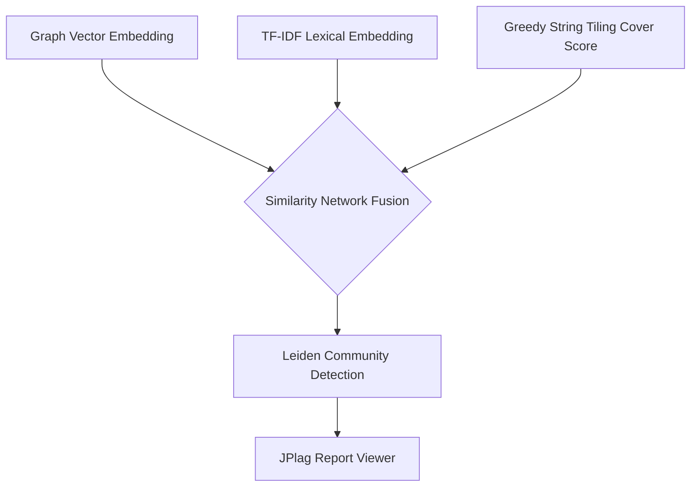

# Multi signal approach


```mermaid
graph TD
    %% Input Signals
    A[Graph Vector Embedding] --> D{Similarity Network Fusion}
    B[TF-IDF Lexical Embedding] --> D
    C[Greedy String Tiling Cover Score] --> D

    %% Processing Pipeline
    D --> E[Leiden Community Detection]

    %% Output
    E --> F[JPlag Report Viewer]
```

### Running for datasets

```bash
docker run \
          -v /path/to/Progpedia:/app/submissions:rw,z \
          -v /path/to/output:/app/output:rw,z \
          -v /path/to/cache:/root/.cache/:rw,z \ # contains diagnostic information
          -it ghcr.io/akanksh-ch/collusion-detection-software:latest \
          python main.py submissions --dataset progpedia19 --fusion-method snf --auto-tune \
              --output output/progpedia19-metrics.json
```

```bash
docker run \
    -v ~/Downloads/ReplicationPackage/code/:/app/submissions:rw,z \
    -v ~/Downloads/ReplicationPackage/cache/:/root/.cache:rw,z \
    -it ghcr.io/akanksh-ch/collusion-detection-software:latest \
    python main.py submissions/orig submissions/plag --dataset criminalminds --fusion-method snf --auto-tune --output submissions/criminalminds-metrics.json
```

### Quick runner command

```bash
docker run \
    -v ~/Downloads/ReplicationPackage/code/:/app/submissions:ro,z \ # ,z is for SELinux purposes
    -v ~/.cache:/root/.cache:rw,z \
    -it cds:latest \
    /bin/bash # Drop into shell for testing
```

