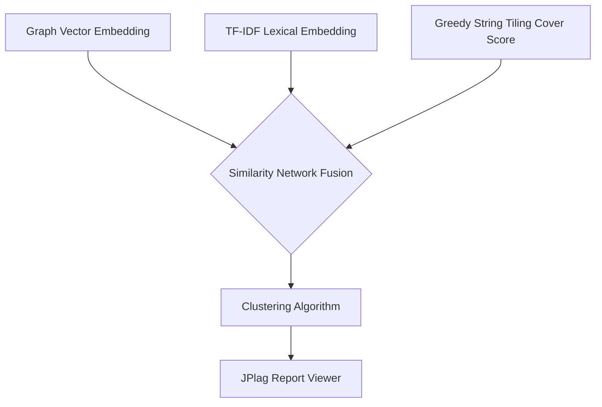

# Collusion Detection Software

This repository contains the implementation of the multi-signal collusion detection approach developed for the dissertation. The system combines graph-based, lexical, and token-level similarity signals using Similarity Network Fusion (SNF), followed by Leiden community detection.


```mermaid
graph TD
    A[Graph Vector Embedding] --> D{Similarity Network Fusion}
    B[TF-IDF Lexical Embedding] --> D
    C[Greedy String Tiling Cover Score] --> D
    D --> E[Clustering Algorithm]
    E --> F[JPlag Report Viewer]
```

## Requirements

The software is run using Docker. Install [Docker](https://docs.docker.com/get-docker/) before proceeding.

The Docker image used is:

```text
ghcr.io/akanksh-ch/collusion-detection-software:latest
```
###


## Running on PROGpedia19

To run the collusion detection software on the **PROGpedia19 dataset**, place the dataset in a local directory and run the following command:

```bash
docker run \
    -v /path/to/Progpedia:/app/submissions:rw,z \
    -v /path/to/output:/app/output:rw,z \
    -v /path/to/cache:/root/.cache:rw,z \
    -it ghcr.io/akanksh-ch/collusion-detection-software:latest \
    python main.py /app/submissions \
        --dataset progpedia19 \
        --fusion-method snf \
        --auto-tune \
        --output /app/output/progpedia19-metrics.json
```

Replace `/path/to/Progpedia` with the location of the PROGpedia19 dataset. `/path/to/output` is where the resulting metrics file will be written, while `/path/to/cache` stores cached and diagnostic information.

## Running on Criminal Minds

To run the software on the **Criminal Minds dataset**, obtain the replication package and place the `orig` and `plag` directories under the `code` directory:

```text
ReplicationPackage/
└── code/
    ├── orig/
    └── plag/
```

For example, if the replication package is located at `~/Downloads/ReplicationPackage`, run:

```bash
docker run \
    -v ~/Downloads/ReplicationPackage/code/:/app/submissions:rw,z \
    -v ~/Downloads/ReplicationPackage/cache/:/root/.cache:rw,z \
    -it ghcr.io/akanksh-ch/collusion-detection-software:latest \
    python main.py /app/submissions/orig /app/submissions/plag \
        --dataset criminalminds \
        --fusion-method snf \
        --auto-tune \
        --output /app/submissions/criminalminds-metrics.json
```

The resulting metrics are written to:

```text
~/Downloads/ReplicationPackage/code/criminalminds-metrics.json
```

The cache directory stores intermediate and diagnostic information and can be reused between runs.

## Docker Shell

For testing or inspecting the software directly inside the Docker container, the following command starts an interactive shell.

The example mounts the Criminal Minds `code` directory as `/app/submissions` and the local cache directory as `/root/.cache`:

```bash
docker run \
    -v ~/Downloads/ReplicationPackage/code/:/app/submissions:ro,z \
    -v ~/.cache:/root/.cache:rw,z \
    -it ghcr.io/akanksh-ch/collusion-detection-software:latest \
    /bin/bash
```

The `:z` mount option is included for SELinux compatibility.
